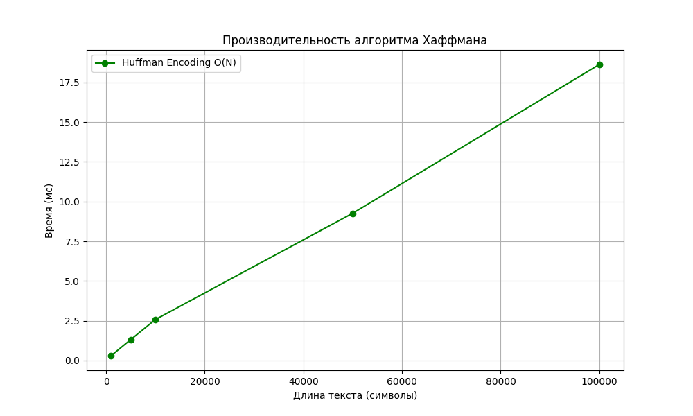

# Лабораторная работа №08
# Жадные алгоритмы

**Дата:** 2025-12-15

**Семестр:** 3 курс 6 семестр

**Группа:** ПИЖ-б-о-23-1

**Дисциплина:** Анализ сложности алгоритмов

**Студент:** Панчешный Александр Алексеевич

---

## Цель работы

Изучить парадигму жадных алгоритмов, освоить принцип локально оптимального выбора.
- Реализовать классические задачи: выбор заявок, непрерывный рюкзак, код Хаффмана.
- Проанализировать корректность жадного выбора.
- Сравнить эффективность жадного подхода с полным перебором на примере дискретного рюкзака.

## Теоретическая часть

## Жадный алгоритм
Алгоритм, который на каждом шаге принимает локально оптимальное решение, надеясь, что итоговое решение будет глобально оптимальным.

**Ключевые свойства:**
1. **Жадный выбор:** Можно сделать оптимальный выбор сейчас, не оглядываясь назад.
2. **Оптимальная подструктура:** Оптимальное решение задачи содержит оптимальные решения её подзадач.

## Реализованные алгоритмы

### 1. Выбор заявок (Interval Scheduling)
- **Задача:** Выбрать макс. число непересекающихся интервалов.
- **Стратегия:** Сортировка по **времени окончания**.
- **Сложность:** O(N log N) (из-за сортировки).
- **Корректность:** Выбирая заявку, которая заканчивается раньше всех, мы оставляем максимально возможное количество времени для остальных заявок.

### 2. Непрерывный рюкзак (Fractional Knapsack)
- **Задача:** Максимизировать стоимость, разрешено брать доли предметов.
- **Стратегия:** Сортировка по убыванию **удельной стоимости (цена / вес)**.
- **Сложность:** O(N log N).
- **Корректность:** Мы всегда берем "самую ценную плоть" из доступных.

### 3. Код Хаффмана (Huffman Coding)
- **Задача:** Построить оптимальный префиксный код для сжатия текста.
- **Стратегия:** Объединение двух символов с **наименьшей частотой**.
- **Сложность:** O(N log N) или O(N) при условии сортировки частот. В реализации O(K log K) для кучи, где K - алфавит.

---

## Характеристики ПК
- CPU: Intel Core i5-12450H
- RAM: 16 GB DDR5
- OS: Windows 11 Pro
- Python: 3.10.9

---

## Результаты анализа

### Сравнение для задачи о Рюкзаке 0-1 (Дискретный)
Было проведено сравнение жадного подхода и полного перебора для задачи, где предметы нельзя делить.

**Входные данные:**
- Вместимость: 50
- Предмет 1: Вес 10, Цена 60 (Ratio 6)
- Предмет 2: Вес 20, Цена 100 (Ratio 5)
- Предмет 3: Вес 30, Цена 120 (Ratio 4)

**Результаты:**
1. **Жадный алгоритм:** Взял Предмет 1 и Предмет 2. Вес 30, Цена **160**. (Предмет 3 не влез).
2. **Оптимальный (Полный перебор):** Взял Предмет 2 и Предмет 3. Вес 50, Цена **220**.

**Вывод:** Жадный алгоритм **НЕ РАБОТАЕТ** для дискретной задачи о рюкзаке (0-1 Knapsack), так как локально оптимальный выбор (самая высокая удельная цена) может заблокировать возможность взять более выгодную комбинацию тяжелых предметов.

### Производительность Хаффмана
График зависимости времени кодирования от длины текста подтверждает линейную сложность O(N) (основное время уходит на чтение текста и частотный анализ).

---

## Контрольные вопросы

### **1. В чем заключается основная идея жадных алгоритмов?**
Жадный алгоритм на каждом шаге выбирает локально лучшее решение,
предполагая, что последовательность таких выборов приведёт к глобальному
оптимуму.

### **2. Для задачи Interval Scheduling жадный выбор по минимальному времени окончания является оптимальным. Почему?**
Такой выбор оставляет наибольшее возможное свободное время для
оставшихся интервалов. Если заменить любой интервал в оптимальном решении на интервал с самым ранним временем окончания, решение не станет хуже —
это и есть обменный аргумент, доказывающий оптимальность.

### **3. Пример задачи, для которой жадный алгоритм оптимален, и задачи,для которой он не дает оптимального решения.** 
- Оптимален: Interval Scheduling (выбор заявок).
- Не оптимален: 0-1 Knapsack (жадный выбор по удельной ценности может дать
  неоптимальный набор предметов).

### **4. В чем разница между дробной и 0-1 задачей о рюкзаке? Для какой жадный алгоритм оптимален?**
В дробной задаче можно брать долю предмета, в 0-1 задаче —
только целиком. Жадный алгоритм оптимален только для дробного рюкзака.

### **5. Опишите жадный алгоритм построения кода Хаффмана и объясните его оптимальность.**
Алгоритм многократно объединяет два узла с минимальными частотами,
создавая дерево префиксного кода. Частые символы оказываются ближе к корню, редкие — глубже. Доказано, что такая структура минимизирует среднюю длину кода среди всех возможных префиксных кодов.